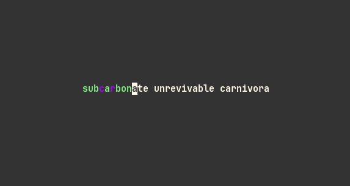
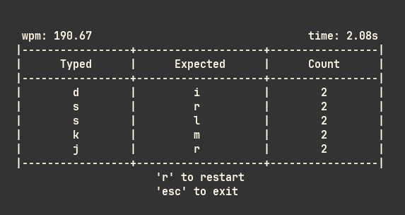

<p align="center">
  
</p>

# Typpy

Terminal-based touch typing trainer with real-time feedback,
error tracking, and WPM stats — built in OCaml using Notty.

# Features

- Live typing interface
- Tracks common mistakes 
- WPM counter
- Execution time
- Summary table of top *k* most frequent mistakes
- Designed for minimal distraction and fast feedback

<p align="center">
  
</p>

# Installation
### Using Opam 
```
opam install dune base notty
git clone https://github.com/Ojkee/Typpy.git
cd Typpy
dune build
dune exec ./main.exe
```

# TODO
- [ ] Selection menu
- [ ] Save progression
- [ ] Generating words with common letter mistakes

