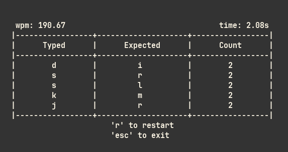

<p align="center">
  
</p>

# Typpy

Terminal-based touch typing trainer with real-time feedback,
error tracking, and WPM stats — built in OCaml using Notty.

# Features

- Live typing interface
- Tracks common mistakes 
- WPM counter
- Execution time
- Summary table of top *k* most frequent mistakes
- Designed for minimal distraction and fast feedback

<p align="center">
  
</p>

# Installation (Linux)
### Opam dependencies
```
opam install dune base notty
```

```
git clone https://github.com/Ojkee/Typpy.git
cd Typpy
dune build
dune exec ./main.exe
```

# Dataset
Dataset contains 370k unfiltered english words. 
[Link to dataset](https://github.com/dwyl/english-words?tab=readme-ov-file)

# TODO
- [x] Selection menu
- [x] Propper navigation between window states
- [x] Punctuation and capitalize modes
- [x] Propper wpm calculator (+raw wpm)
- [x] Word counter
- [ ] Infinity mode 
- [ ] Adaptive word randomizer on infinity mode
- [ ] Save progression
- [ ] Generating words with common letter mistakes
- [ ] Per-character timing for advanced stats
- [ ] Implement arrow keys

# Bugs
- [x] Summary wraps incorectly at the end of big table
